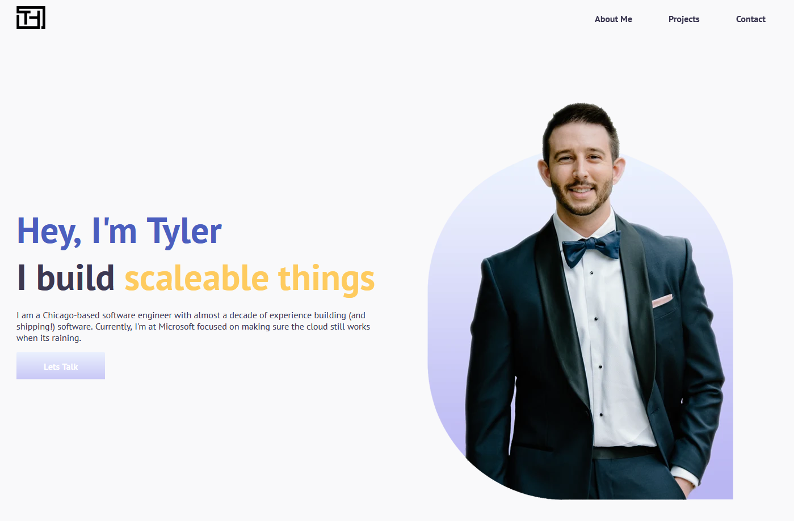

<h1 align="center">tylerhirschel.com</h1>
<div align="center">

[](https://app.netlify.com/sites/shiny-dieffenbachia-772863/deploys)

</div>



## Setting up development environment 🛠

```sh
npm run develop
```

## Building production 🚀

```sh
npm run build
// This will output a folder called public
```